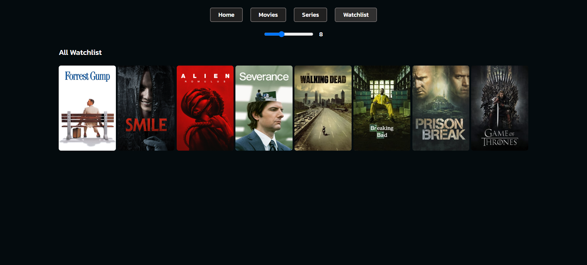
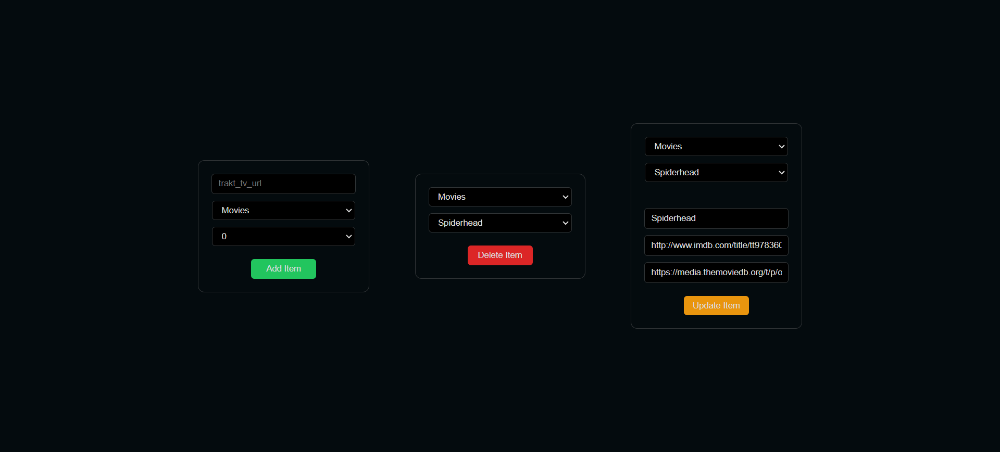

# Movies and Series

This project is a custom web application designed to manage my personal collection of movies and TV series. It serves as a digital library where I keep track of all the content I watch and plan to watch.

## Live Demo

Check out the live demo of the project at : [https://ahmetalper-movies-and-series.hf.space](https://ahmetalper-movies-and-series.hf.space)

## Technologies

- Backend: Python (FastAPI)
- Frontend: HTML, CSS, JavaScript, Jinja2 Templates
- Database: Supabase

## Features

- Separate pages for movies, series, watchlist and admin
- Automatic data fetching with TMDB and IMDB integration
- Admin panel for collection management
- Responsive page design

## Screenshots

### Home Page

### Movies Page

### Series Page

### Watchlist Page

### Admin Page

